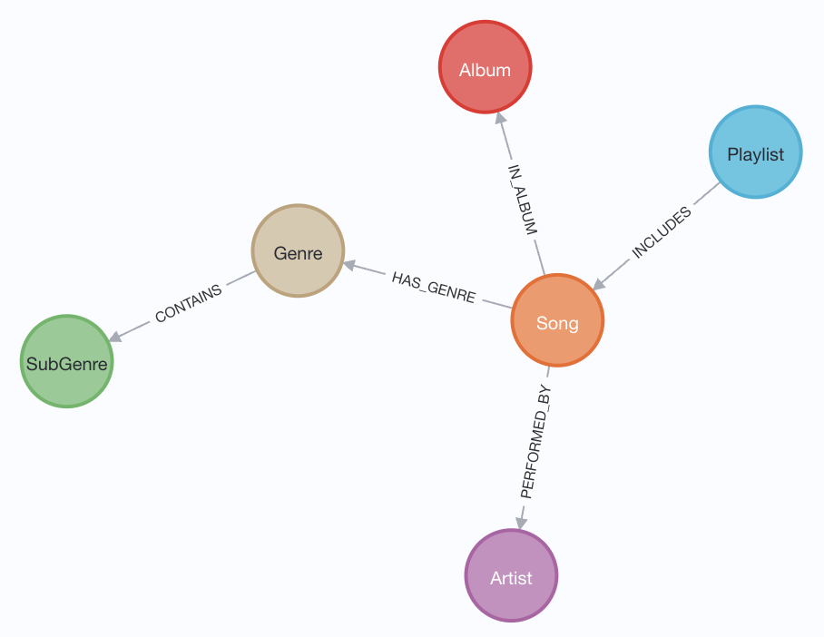

# 🎧 Stunes
**Melon Playlist Dataset 기반 GraphRAG 음악 검색 및 추천 서비스**

Stunes is a music recommendation and search system that leverages a graph-based database to model relationships between songs, artists, albums, genres, subgenres, and playlists. By utilizing the [Melon Playlist Dataset](https://mtg.github.io/melon-playlist-dataset/), Stunes builds a GraphRAG (Graph Retrieval-Augmented Generation) pipeline.


## 📊 Datasets Used
This project uses the Melon Playlist Dataset, a public music information retrieval (MIR) dataset provided by Kakao Corp. It contains data from Melon, Korea's music streaming platform, and was originally designed for playlist continuation tasks:    
- **[Melon Playlist Dataset](https://mtg.github.io/melon-playlist-dataset/)**   

To suit the project requirements, only the necessary information from the Melon Playlist Dataset was extracted and transformed into a graph structure with nodes and edges.

### 🚀 Details
  - **Nodes**:
    - Song: 707,989
    - Artist: 115,456
    - Album: 287,235
    - Genre: 30
    - SubGenre: 219
    - Playlist: 115,071
  - **Relationships**:
    - PERFORMED_BY: 779,461
    - INCLUDES: 5,285,871
    - IN_ALBUM: 707,989
    - HAS_GENRE: 802,859
    - CONTAINS: 1,054
  - **Node Attributes**:
    - **Song**: `PERFORMED_BY`, `IN_ALBUM`, `HAS_GENRE`, `title`, `issue_date`, `song_id`, `embedding`
    - **Artist**: `name`, `artist_id`, `embedding`
    - **Album**: `title`, `issue_date`, `album_id`, `embedding`
    - **Genre**: `CONTAINS`, `name`, `genre_id`, `embedding`
    - **SubGenre**: `name`, `subgenre_id`, `embedding`
    - **Playlist**: `INCLUDES`, `HAS_TAG`, `title`, `like_cnt`, `updt_date`, `playlist_id`, `embedding`

**Graph Schema Diagram**:



## 🛠️ Tech Stack
> - Database: Neo4j
> - AI: OpenAI embeddings(`text-embedding-3-small`) + LangChain (GraphRAG)
> - Backend: FastAPI (REST endpoints)
> - Frontend: Streamlit

## 📁 Folder Structure

```
src/
├── api/                    
│   ├── __init__.py
│   └── main.py
├── core/                   
│   ├── __init__.py
│   ├── config.py
│   └── database.py
├── models/                 
│   ├── __init__.py
│   └── schemas.py
├── services/               
│   ├── __init__.py
│   ├── rag_service.py
│   ├── recommendation_service.py
│   └── search_service.py
├── ui/                     
│   └── streamlit_app.py
├── .gitignore              
├── README.md              
└── __init__.py             
```
